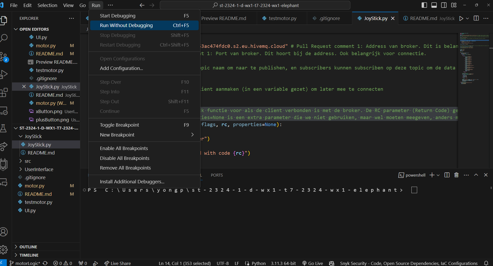
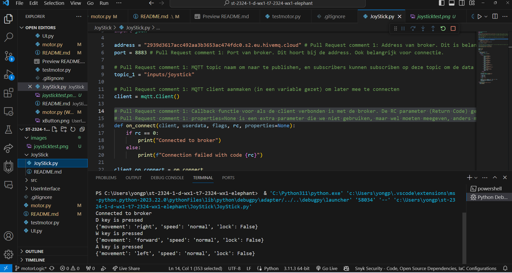
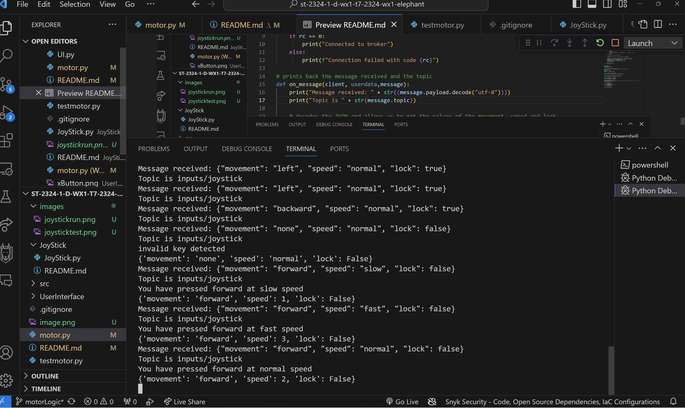
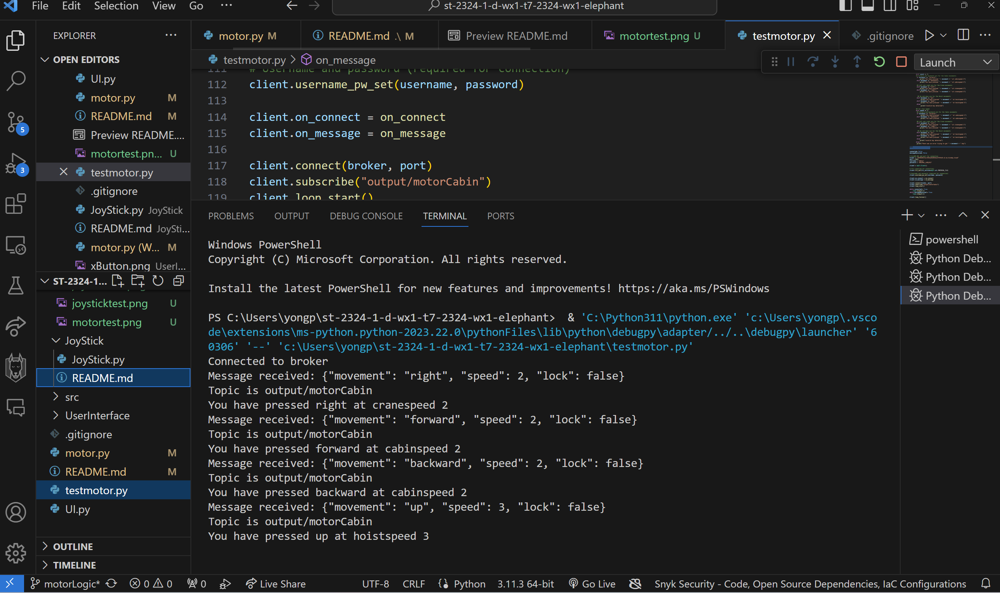
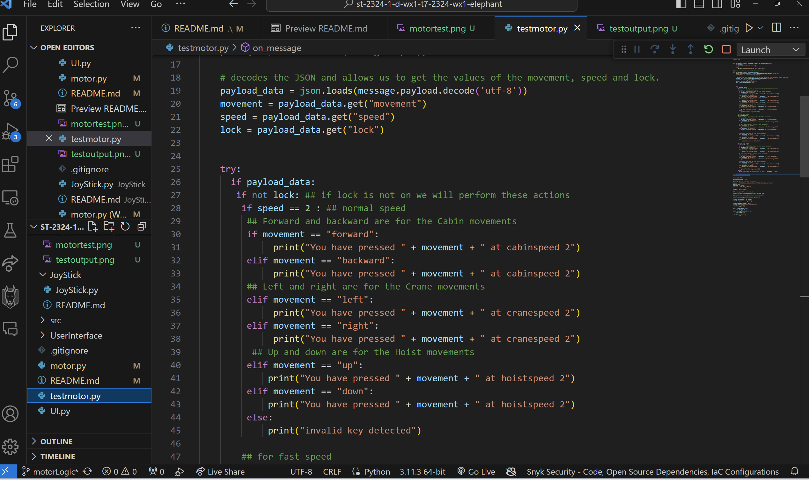

# MotorLogic 

Documentation of the Motorlogic
* **What is Motorlogic?**
* **How to apply it to MQTT?**
* **Tests**

## What is MotorLogic?
The motorLogic is how we apply the code behind how the motor functions in the Crane. For the Crane we have seperate entities like
* Crane
* Cabin
* Hoist

With the motorLogic we define the speed and movements of said entities and also whether they are allowed to move beyond a certain point. This is to ensure that the movement makes sense and does not go out of bound.

## Inputs are (taken from Joystick.py ReadMe.MD):
#### Crane movements and spreader lock/unlock

- **W**
- **A**
- **S**
- **D**
- **Up Arrow**
- **Down Arrow**
- **Enter:** Toggle lock/unlock spreader

#### Speed control of the crane with shift/ctrl

The speed of movement is determined by additional keys:

- **Shift:** Fast speed
- **Ctrl:** Slow speed

## How to apply it to MQTT?
Okay cool, but how do we do this in conjunction with MQTT?

* Step 1: **Joystick.py connects with the HiveMQ broker**

    We have the Joystick.py that takes input from our keyboard.. which it then publishes it as a JSON to the HiveMQ Broker as topic 'inputs/joystick'. 

* Step 2: **motor.py subscribes to the topic 'inputs/joystick'**

    motor.py subscribes to the topic of the joystick and then creates logic around the payload data like the movement, speed and whether it is locked or not.

* Step 3: **motor.py publishes the data to output/motorCabin**

    A file can be publisher aswell as subscriber. With that in mind, motor.py can also publish the payload to another topic we will call output/motorCabin. Other files can subscribe to this topic and then make use of it.

## Tests
### To test whether it works we will first run the JoyStick.py.

### After that we want to run the motor.py
### Pressing buttons like w is considered forward, shift is fast and ctrl is slow,enter button is to lock/unlock. The payload here was changed from slow , normal and fast to 1 , 2 , 3 but it works either way.

### Here we receive the output from output/motorCabin and we can decide what to do if certain conditions are met..

### If we want the crane to perform actions we can replace the current print with variables that can change how the pygame view works like adjusting the x y z axis of the crane.

